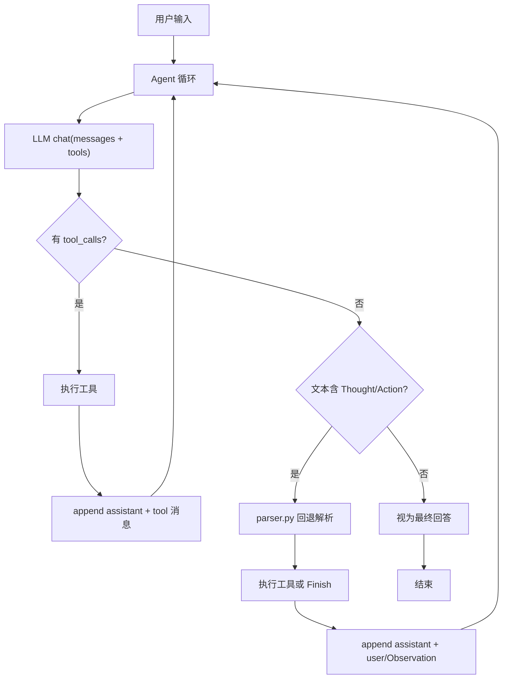

# Chapter 01：ReAct 旅行助手（v2 优化版）

v2 在 v1 基础上实现 **混合 Agent**：Tool Calling 优先 + 规范多轮 messages + 文本 ReAct 自动回退。

与 v1 完全隔离，所有代码位于 `code/v2/`，不 import 上级目录的 v1 模块。

## 项目结构

```
v2/
├── main.py           # 入口
├── config.py         # 环境变量 + CLI + 启动校验
├── tools.py          # 工具函数 + TOOL_SCHEMAS
├── pyproject.toml    # 独立依赖
├── .env.example      # 环境变量模板
└── agent/
    ├── client.py     # LLM 客户端
    ├── parser.py     # 文本 ReAct 回退解析
    └── agent.py      # TravelAgent 混合循环
```

## 快速开始

### 1. 安装依赖

```bash
cd hello-agents/chapter-01/code/v2
uv sync
```

### 2. 配置环境变量

首次使用可复制 v1 的配置：

```bash
cp ../.env .env
```

或参考 `.env.example` 自行创建 `v2/.env`。若 v2 下无 `.env`，会自动回退加载 `../.env`。

### 3. 运行

```bash
uv run python main.py
uv run python main.py --prompt "上海今天适合去哪玩？"
uv run python main.py --max-steps 8
```

## 架构



### 三条执行路径

1. **Tool Calling 主路径**：模型返回 `tool_calls` → 执行工具 → append `tool` 消息 → 继续循环
2. **文本 ReAct 回退**：模型不支持 tool calling 时，解析 `Thought/Action` → 执行或 `Finish`
3. **纯文本结束**：无 tool_calls、无法解析 Action → 视为最终回答

### 规范多轮 messages

v2 始终维护结构化对话历史：

```python
messages = [
    {"role": "system", "content": "..."},
    {"role": "user", "content": "查北京天气..."},
    {"role": "assistant", "content": "...", "tool_calls": [...]},
    {"role": "tool", "tool_call_id": "...", "content": "北京当前天气:晴..."},
]
```

## v1 vs v2 对比

| | v1（`code/` 根目录） | v2（`code/v2/`） |
|--|---------------------|------------------|
| 位置 | flat 单文件 | 独立子目录 + agent 模块 |
| 对话历史 | 拼成单个 user 字符串 | 规范多轮 messages |
| 工具调用 | 正则解析 Action | Tool Calling 优先 + ReAct 回退 |
| 错误处理 | 可能 AttributeError | 结构化错误 + 自我纠正 |
| 配置 | 硬编码 prompt | CLI + 启动校验 |
| 依赖 | `code/.venv` | `v2/.venv`（独立） |

## 运行 v1

v1 原版仍在 `code/` 根目录：

```bash
cd hello-agents/chapter-01/code
uv run python main.py
```
